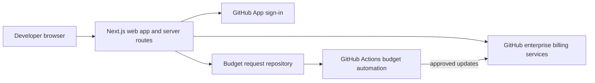

# GitHub Copilot AI Credit Dashboard

A self-service dashboard for developers to understand their own GitHub Copilot
AI credit usage and effective budget. The app signs users in with a GitHub App,
verifies enterprise membership, and reads billing data with a privileged token
that stays on the server.

## Key capabilities

- Monthly personal usage, model breakdowns, six-month trends, and
  comma-separated values (CSV) export
- Effective-budget display and a current-month spending forecast
- Optional, reviewable budget-increase requests through GitHub issues
- GitHub Actions triage with protected apply and rollback workflows
- Credential-free local demo mode with synthetic data
- Docker support for local container development

The application has no database. It fetches current billing data from GitHub
when requested.

## How it fits together



See [Architecture](docs/architecture.md) for the full runtime design.

## Demo quick start

Requires [Node.js 20 or later](https://nodejs.org/) and npm. In PowerShell:

```powershell
npm install
$env:DEMO_ENV = "true"
npm run dev
```

Open <http://localhost:3000>. Demo mode uses synthetic data, skips GitHub
sign-in, never calls GitHub, and disables budget requests. It works only in
development.

## Configured local quick start

1. Create a GitHub App with callback URL
   `http://localhost:3000/api/auth/github/callback`.
2. [Create the dashboard read PAT with the required scopes preselected](https://github.com/settings/tokens/new?description=ghcp-aic-dash-read&scopes=manage_billing%3Acopilot%2Cread%3Aenterprise),
   then generate and securely copy the classic PAT.
3. Copy the environment template and fill in the required values:

   ```powershell
   Copy-Item .env.example .env
   ```

4. Start the app:

   ```powershell
   npm install
   npm run dev
   ```

Open <http://localhost:3000> and sign in. Never commit `.env`. For every
setting and GitHub App step, see [Configuration](docs/configuration.md).

## Common commands

| Command | Purpose |
| --- | --- |
| `npm run dev` | Start the Next.js development server |
| `npm run build` | Create a production build |
| `npm run start` | Serve a production build |
| `npm run lint` | Run ESLint |
| `npm run test` | Run the Vitest suite once |
| `npm run test:watch` | Run Vitest in watch mode |
| `docker compose up --build` | Build and run the local container |

## Documentation

- [Onboarding](docs/onboarding.md) — first tour and safe first change
- [Contributing](CONTRIBUTING.md) — contribution workflow and validation
- [Development](docs/development.md) — local setup, commands, conventions, and troubleshooting
- [Architecture](docs/architecture.md) — components and data flow
- [Configuration](docs/configuration.md) — environment variables and GitHub setup
- [IssueOps](docs/issueops.md) — streamlined installation and staged enablement
- [IssueOps operations](docs/issueops-operations.md) — approval, apply, rollback, and emergencies
- [IssueOps protocol](docs/issueops-protocol.md) — schemas, labels, markers, and audit contracts
- [Security](docs/security.md) — trust boundaries, credentials, and controls
- [Glossary](docs/glossary.md) — recurring terms and acronyms
- [Support](SUPPORT.md) — where to ask questions and report problems
- [Code of Conduct](CODE_OF_CONDUCT.md) — community expectations

## Security

The dashboard is self-scoped: browser input cannot select another user. Open
Authorization (OAuth) access tokens are discarded after identity lookup,
sessions are signed with a hash-based message authentication code (HMAC),
billing credentials remain server-side, and enterprise checks fail closed.
Budget writes are disabled and dry-run by default. Read
[Security](docs/security.md) before changing authentication, authorization,
billing access, or IssueOps.

## License

Licensed under the [MIT License](LICENSE).
